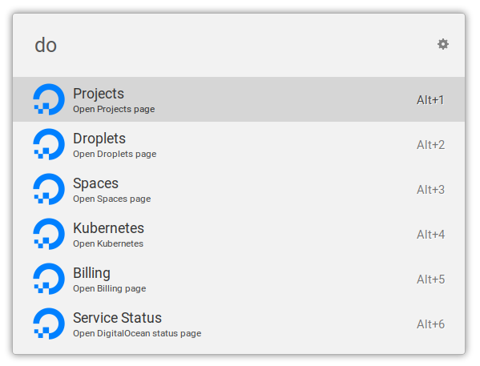

# Ulauncher DigitalOcean Extension

[](https://ext.ulauncher.io/-/github-brpaz-ulauncher-digitalocean)
[](https://circleci.com/gh/brpaz/ulauncher-digitalocean)


> Ulauncher extension that provides quick access to your DigitalOcean account

## Demo



## Requirements

- Ulauncher 5
- Python >= 3

## Install

Open ulauncher preferences window -> extensions -> add extension and paste the following url:

```
https://github.com/brpaz/ulauncher-digitalocean
```

## Development

```
git clone https://github.com/brpaz/ulauncher-digitalocean
make link
```

The `make link` command will symlink the cloned repo into the appropriate location on the ulauncher extensions folder.

To see your changes, stop ulauncher and run it from the command line with: `ulauncher -v`.

## Contributing

- Fork it!
- Create your feature branch: git checkout -b my-new-feature
- Commit your changes: git commit -am 'Add some feature'
- Push to the branch: git push origin my-new-feature
- Submit a pull request :D

## Show your support

<a href="https://www.buymeacoffee.com/Z1Bu6asGV" target="_blank"></a>

## License 

Copywright @ 2019 [Bruno Paz](https://github.com/brpaz)

This project is [MIT](LLICENSE) Licensed.
